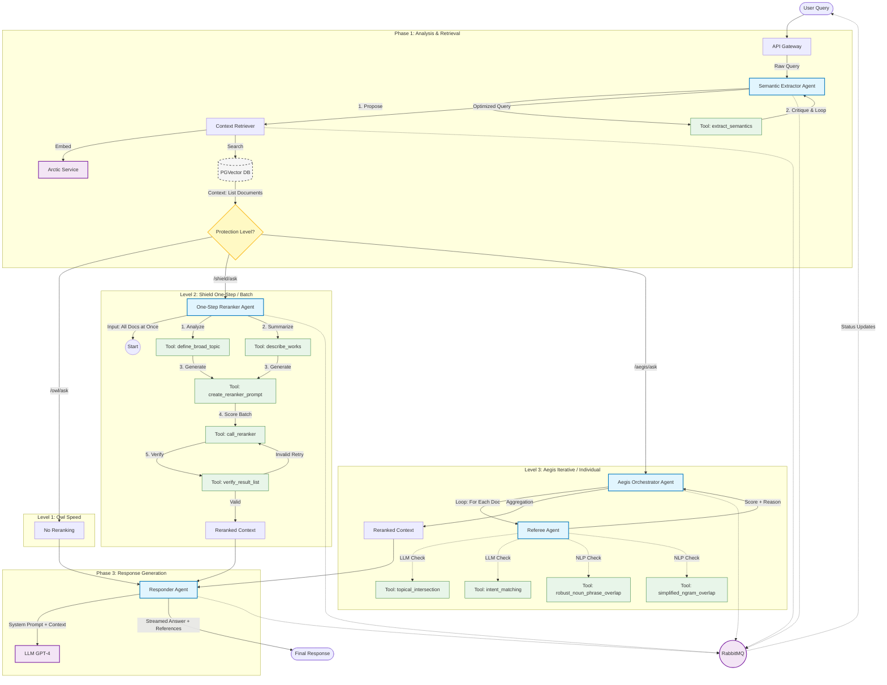

# Ask Aithena Agent Architecture

```mermaid
graph TD
    %% Styling
    classDef agent fill:#e1f5fe,stroke:#0277bd,stroke-width:2px;
    classDef tool fill:#e8f5e9,stroke:#2e7d32,stroke-width:1px;
    classDef storage fill:#f5f5f5,stroke:#616161,stroke-width:2px,stroke-dasharray: 5 5;
    classDef external fill:#f3e5f5,stroke:#7b1fa2,stroke-width:2px;
    classDef logic fill:#fff9c4,stroke:#fbc02d,stroke-width:2px;
    
    User([User Query]) --> API[API Gateway]
    
    subgraph Phase1["Phase 1: Analysis & Retrieval"]
        API -->|Raw Query| SemExt[Semantic Extractor Agent]
        
        SemExt -->|1. Propose| SemTool[Tool: extract_semantics]
        SemTool -->|2. Critique & Loop| SemExt
        
        SemExt -->|Optimized Query| ContextRet[Context Retriever]
        
        ContextRet -->|Embed| Arctic[Arctic Service]
        
        ContextRet -->|Search| PG[(PGVector DB)]
        
        PG -->|Context: List Documents| ModeSwitch{Protection Level?}
    end
    
    subgraph Owl["Level 1: Owl Speed"]
        ModeSwitch -->|/owl/ask| OwlPass[No Reranking]
    end
    
    subgraph Shield["Level 2: Shield One-Step / Batch"]
        ModeSwitch -->|/shield/ask| ShieldAgent[One-Step Reranker Agent]
        
        ShieldAgent -->|Input: All Docs at Once| S_Start((Start))
        
        ShieldAgent -->|1. Analyze| S_Topic[Tool: define_broad_topic]
        ShieldAgent -->|2. Summarize| S_Desc[Tool: describe_works]
        
        S_Topic & S_Desc -->|3. Generate| S_Prompt[Tool: create_reranker_prompt]
        
        S_Prompt -->|4. Score Batch| S_Call[Tool: call_reranker]
        
        S_Call -->|5. Verify| S_Verify[Tool: verify_result_list]
        
        S_Verify -->|Valid| ShieldContext[Reranked Context]
        S_Verify -->|Invalid Retry| S_Call
    end
    
    subgraph Aegis["Level 3: Aegis Iterative / Individual"]
        ModeSwitch -->|/aegis/ask| AegisOrch[Aegis Orchestrator Agent]
        
        AegisOrch -->|Loop: For Each Doc| Referee[Referee Agent]
        
        Referee -.->|LLM Check| T_Topic[Tool: topical_intersection]
        Referee -.->|LLM Check| T_Intent[Tool: intent_matching]
        Referee -.->|NLP Check| T_Noun[Tool: robust_noun_phrase_overlap]
        Referee -.->|NLP Check| T_Ngram[Tool: simplified_ngram_overlap]
        
        Referee -->|Score + Reason| AegisOrch
        AegisOrch -->|Aggregation| AegisContext[Reranked Context]
    end
    
    subgraph Phase3["Phase 3: Response Generation"]
        OwlPass --> Responder[Responder Agent]
        ShieldContext --> Responder
        AegisContext --> Responder
        
        Responder -->|System Prompt + Context| LLM[LLM GPT-4]
    end
    
    Responder -->|Streamed Answer + References| FinalOutput([Final Response])
    
    RabbitMQ((RabbitMQ)) -.->|Status Updates| User
    SemExt -.-> RabbitMQ
    ContextRet -.-> RabbitMQ
    ShieldAgent -.-> RabbitMQ
    AegisOrch -.-> RabbitMQ
    Responder -.-> RabbitMQ
    
    class SemExt,ShieldAgent,AegisOrch,Referee,Responder agent;
    class SemTool,S_Topic,S_Desc,S_Prompt,S_Call,S_Verify,T_Topic,T_Intent,T_Noun,T_Ngram tool;
    class PG storage;
    class Arctic,LLM,RabbitMQ external;
    class ModeSwitch logic;
```