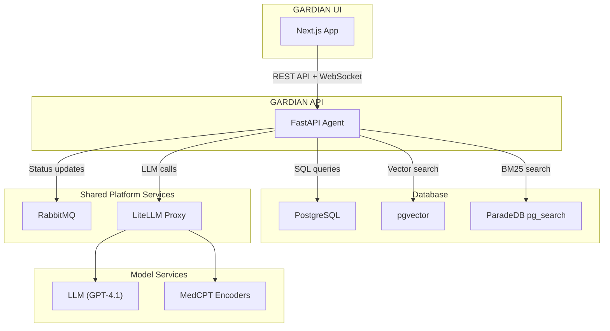
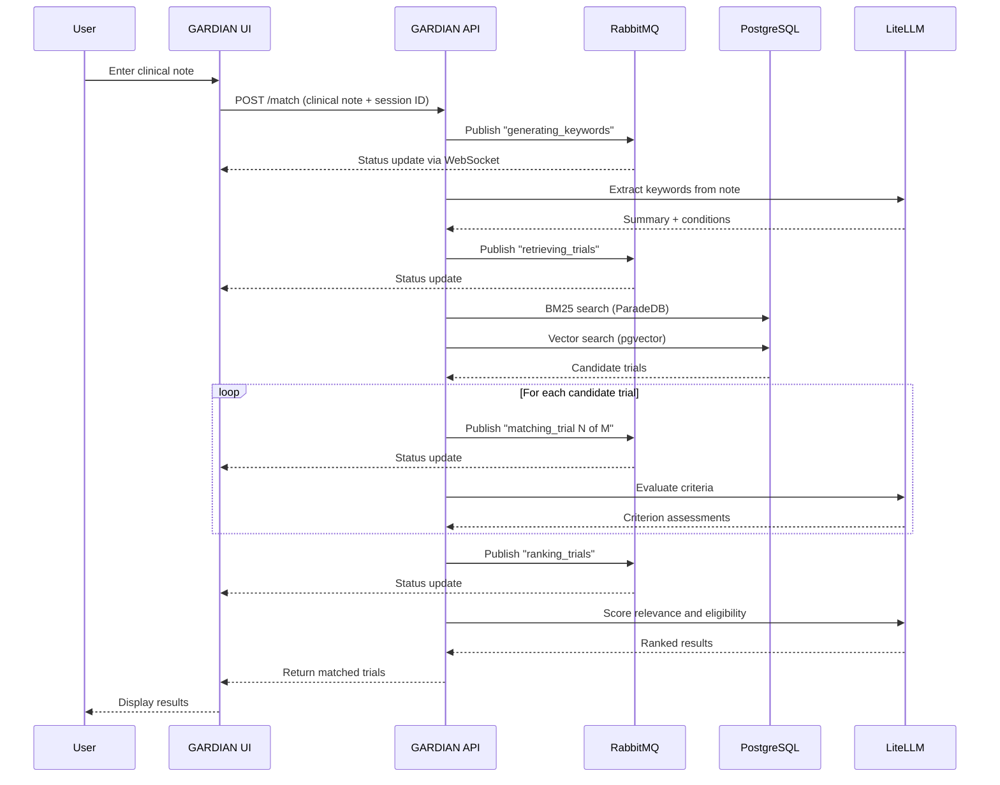

# System Architecture

GARDIAN's architecture is inspired by [Ask Aithena](https://github.com/PolusAI/aithena), following the same design patterns and shared infrastructure established by the Aithena platform. Both systems use a common architectural template: a Next.js frontend, a FastAPI backend agent, PostgreSQL for data storage, and shared platform services for messaging and LLM access.

## Component Overview

## Components

### GARDIAN UI (Next.js)

The frontend is a Next.js application (React 19) that provides the user-facing interface. It communicates with the API through:

- **REST calls** for search, statistics, and initiating patient matching
- **WebSocket** for receiving real-time progress updates during the matching pipeline

The UI follows the same patterns as Ask Aithena's frontend, including theme support (light/dark mode) and a responsive layout.

### GARDIAN API (FastAPI)

The backend agent is a FastAPI application that handles all business logic:

- **Search** — Queries the database for trials matching user criteria
- **Statistics** — Aggregates corpus-level information (trial counts, conditions, phases)
- **Patient matching** — Orchestrates the full five-stage pipeline (keyword extraction, retrieval, matching, ranking)
- **Health checks** — Reports service status for Kubernetes liveness and readiness probes

The API is stateless — all state lives in PostgreSQL or is passed per-request. This allows horizontal scaling by running multiple API replicas behind a load balancer.

### PostgreSQL

PostgreSQL serves as the single data store, extended with two key extensions:

- **pgvector** — Adds vector data types and HNSW indexes for fast approximate nearest-neighbor search, used by the semantic retrieval component
- **ParadeDB pg_search** — Adds BM25 full-text search capabilities, used by the keyword retrieval component

This "everything in Postgres" approach avoids the operational complexity of managing separate search engines (like Elasticsearch) or vector databases (like Pinecone). PostgreSQL handles CRUD operations, full-text search, and vector search in a single system.

### RabbitMQ (Shared)

RabbitMQ provides asynchronous messaging for real-time status updates. During the matching pipeline:

1. The API publishes status messages to a topic exchange with session-specific routing
2. A WebSocket endpoint subscribes to messages for the connected session
3. Messages are relayed to the browser in real time

RabbitMQ is a shared service from the Aithena platform, deployed in the `box` namespace and reused across multiple applications. GARDIAN connects to it but does not manage its lifecycle.

### LiteLLM Proxy (Shared)

LiteLLM provides a unified OpenAI-compatible API for accessing multiple model providers. GARDIAN uses it for:

- **LLM calls** — Keyword extraction, criterion matching, and ranking (routed to GPT-4.1)
- **Embedding generation** — MedCPT article and query encoding

Like RabbitMQ, LiteLLM is a shared platform service. This abstraction means the underlying LLM provider can be changed without modifying GARDIAN's code — only the LiteLLM configuration needs updating.

## Aithena Monorepo Conventions

GARDIAN follows the Aithena monorepo structure:

| Directory | Purpose |
|-----------|---------|
| `agents/clinical-aithena-agent/` | Backend API agent, CLI tools, pipeline logic, and deployment manifests |
| `apps/clinical-aithena-app/` | Frontend Next.js application and its deployment manifests |

This mirrors the pattern established by Ask Aithena (`agents/ask-aithena-agent/` and `apps/ask-aithena-app/`), making the codebase navigable for anyone familiar with the platform.

## Data Flow

