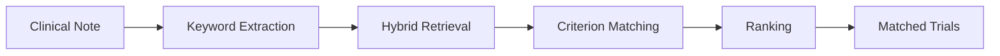

# How It Works

GARDIAN matches patients to clinical trials through a five-stage pipeline. Starting from a patient's clinical note, the system progressively narrows the search space from hundreds of thousands of trials down to a ranked list of the most relevant matches — with detailed explanations of why each trial fits.

## Pipeline Overview

## The Five Stages

### 1. Keyword Extraction

The pipeline begins by analyzing the patient's clinical note using a large language model. The LLM produces:

- A **clinical summary** of the patient's main medical problems
- Up to **32 search conditions**, ordered by clinical priority

These conditions become the search queries used in the next stage. The ordering matters — conditions listed first represent the most clinically significant aspects of the patient's case and receive higher weight during retrieval.

### 2. Hybrid Retrieval

Each search condition is used to query the trial database through two complementary methods:

- **BM25 keyword search** (via ParadeDB) — Finds trials containing the exact medical terms from the condition. Title matches are weighted 3x, metadata 2x, and full text 1x.
- **Semantic search** (via MedCPT + pgvector) — Finds trials that are conceptually related to the condition, even if different terminology is used.

Results from both methods are combined using **Reciprocal Rank Fusion (RRF)**, which merges ranked lists into a single ordering. Earlier conditions contribute more to the final score, reflecting their higher clinical priority.

The retrieval stage searches deep — up to 2,000 results per condition per method — to maximize coverage across the full 570,000+ trial corpus. See [Trial Retrieval](retrieval.md) for more detail.

### 3. Candidate Loading

The top-scoring trials from retrieval are loaded in full from the database. This includes the complete trial record: title, summary, inclusion criteria, exclusion criteria, disease classifications, drugs, and phase information.

### 4. Criterion-Level Matching

This is the most detailed stage. For each candidate trial, the LLM evaluates **every inclusion and exclusion criterion individually** against the patient's clinical note.

For each criterion, the model produces:

- A **reasoning explanation** of how the patient relates to this criterion
- **Evidence references** — which sentences in the clinical note support the assessment
- A **classification label**:
    - Inclusion criteria: `included`, `not included`, or `not applicable`
    - Exclusion criteria: `excluded`, `not excluded`, or `not applicable`

See [Patient Matching](matching.md) for more detail.

### 5. Ranking

Finally, the LLM reviews each trial's complete matching assessment and assigns two scores:

- **Relevance score (R)**: 0–100, measuring how clinically relevant the trial is to the patient
- **Eligibility score (E)**: ranging from -R to +R, measuring the patient's likely eligibility

Trials are sorted by relevance first, then eligibility. Each trial's result includes the LLM's explanation of its scoring rationale, making the output fully interpretable.

## Real-Time Progress

Throughout the pipeline, GARDIAN provides live status updates to the user interface via WebSocket. Each stage reports its progress — from "Generating keywords" through "Matching trial 3 of 10" to the final results — so users always know what the system is doing and approximately how long it will take.
