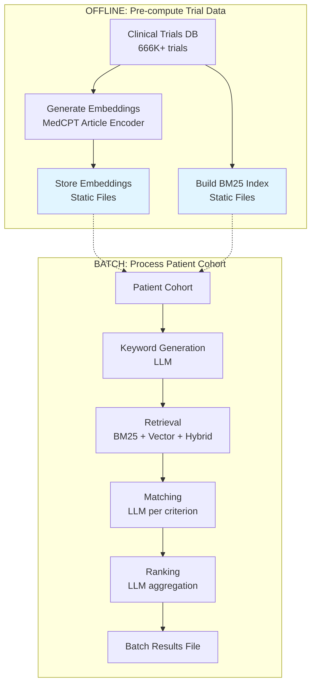
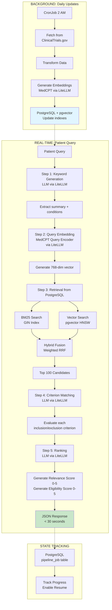
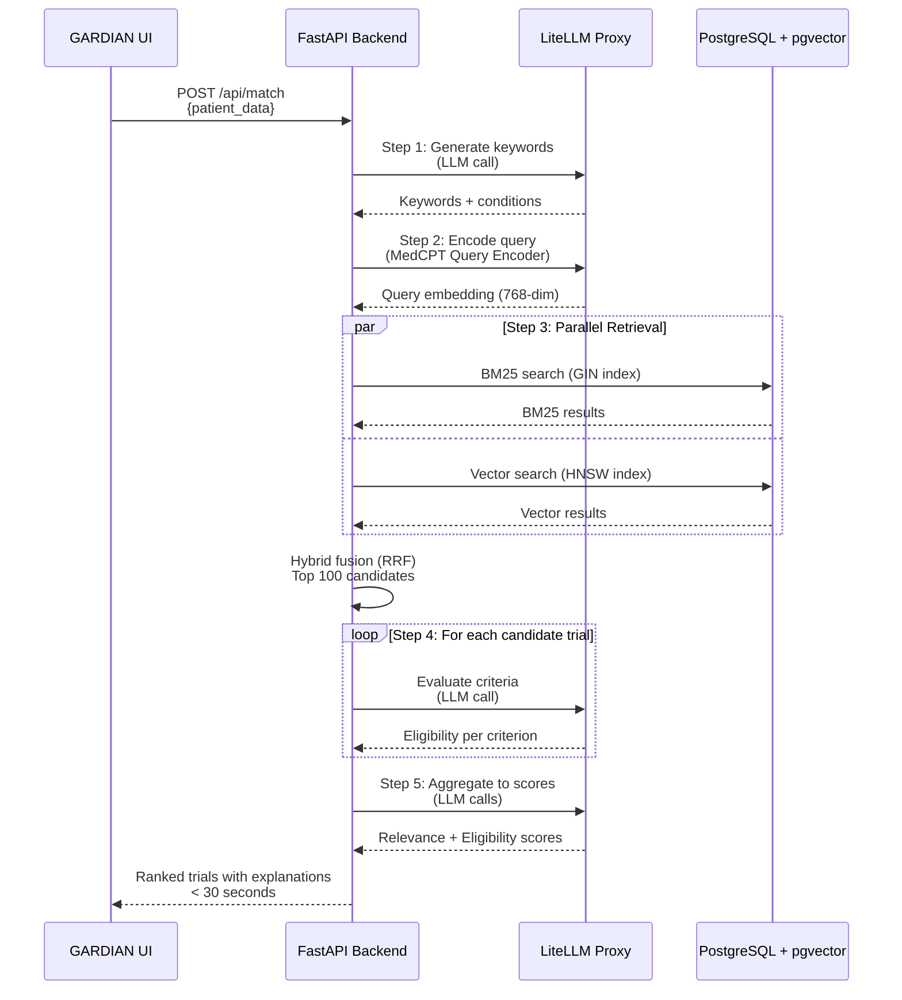

# GARDIAN - GARD Intelligent Association Network

> Linking individuals with rare diseases to clinical trials

A Next.js application for discovering and matching clinical trials with patients who have rare diseases. Built for NCATS/NIH GARD program.

## Features

- 🔍 **Smart Search**: Real-time search and filtering of clinical trials
- 📊 **Dashboard**: Overview statistics of available trials
- 🎨 **Modern UI**: Beautiful, responsive design with light/dark mode
- 🧬 **Rare Disease Focus**: Specialized for GARD rare disease matching
- ⚡ **Fast**: Built with Next.js 16 and React 19

## Getting Started

### Prerequisites

1. Node.js 18+ and npm
2. Clinical Aithena API backend running (see `@agents/clinical-aithena-agent`)

### Setup

1. Install dependencies:
```bash
npm install
```

2. Configure environment variables:
```bash
# Copy the example file
cp env.example .env

# Edit .env and set your API URL
# Example: NEXT_PUBLIC_API_URL=http://localhost:8000
```

3. Start the development server:
```bash
npm run dev
```

Open [http://localhost:3000](http://localhost:3000) to view the application.

### Production

```bash
npm run build
npm start
```

## Backend Integration

The application requires the Clinical Aithena FastAPI backend to be running. Configure the connection by setting `NEXT_PUBLIC_API_URL` in your `.env` file:

```bash
# .env
NEXT_PUBLIC_API_URL=http://localhost:8000
```

The app will not function without a valid API backend configured.

## API Endpoints

The frontend connects to the following backend endpoints:

### GET `/search`
Search and filter clinical trials

**Query Parameters:**
- `keyword` (optional): Keyword to filter by title (case-insensitive)
- `page` (optional): Page number (1-indexed, default: 1)
- `page_size` (optional): Number of results per page (1-100, default: 10)

**Response:**
```json
{
  "total": 100,
  "page": 1,
  "page_size": 10,
  "total_pages": 10,
  "results": [/* Array of CTGovStudy objects */]
}
```

### GET `/stats`
Get aggregated database statistics

**Response:**
```json
{
  "total": 562856,
  "recruiting": 125430,
  "interventional": 420000,
  "observational": 142856
}
```

Returns counts of:
- `total`: Total number of studies in database (latest versions only)
- `recruiting`: Number of studies currently recruiting
- `interventional`: Number of interventional studies
- `observational`: Number of observational studies

See the backend API documentation at `http://localhost:8000/docs` when running the API server for full endpoint details.

## System Architecture

### TrialGPT vs GARDIAN: Processing Models

GARDIAN adapts the TrialGPT algorithm from batch processing to real-time patient matching.

#### TrialGPT: Batch Processing Pipeline



**Characteristics:** Pre-compute everything possible, process entire cohort in one run, can take hours/days.

#### GARDIAN: Real-Time Pipeline



**Characteristics:** Real-time queries, fresh processing per query, continuous trial updates, < 30 second response time.

### Infrastructure Components

#### LiteLLM Proxy
- **Purpose:** Unified API gateway for LLM and embedding models
- **Models Served:**
  - `medcpt-article`: Trial embedding generation (768-dim)
  - `medcpt-query`: Patient query embedding (768-dim)
  - LLM model: Keyword generation, matching, ranking
- **Backend:** Ollama with deployed MedCPT models
- **Endpoint:** `http://polus1.ncats.nih.gov/apis/litellm`

#### PostgreSQL + pgvector
- **Purpose:** Trial database with vector search capability
- **Tables:**
  - `ctgovstudy`: Raw ClinicalTrials.gov data (666K+ trials)
  - `trialgpt_study`: Transformed trial data with embeddings (768-dim vectors)
- **Indexes:**
  - HNSW: Fast approximate nearest neighbor (vector search)
  - GIN: Full-text search (BM25)
- **Updates:** Daily CronJob at 2 AM
- **Pre-computed:** Trial embeddings and indexes (updated daily)

#### Data Flow: Patient Query → Results



### Key Differences: Batch vs Real-Time

| Aspect | TrialGPT (Batch) | GARDIAN (Real-Time) |
|--------|-----------------|---------------------|
| **Input** | Fixed patient cohort | Dynamic queries |
| **Trial Data** | Static snapshot | Updated daily (CronJob) |
| **Embeddings** | Pre-computed once | Pre-computed, updated daily |
| **Storage** | Files | PostgreSQL + pgvector |
| **Query Embedding** | Pre-computed patient embeddings | Generated fresh per query |
| **Processing** | Batch all patients | Fresh processing per query |
| **API** | None (CLI only) | REST API |
| **Latency** | Hours/days | < 30 seconds |

### GARDIAN-Specific Components

These components are **not in TrialGPT** but required for real-time operation:

1. **Real-time Query Embedding**: Generate fresh embeddings per query using MedCPT Query Encoder
2. **Database Integration**: PostgreSQL with pgvector for fast indexed search (HNSW + GIN)
3. **Fresh Processing**: Each query processed independently without caching assumptions
4. **API Layer**: REST endpoints for web/mobile apps
5. **Incremental Updates**: Daily CronJob for trial database updates (non-blocking)
6. **Concurrent Handling**: Async operations, connection pooling for multiple users
7. **Sub-30 Second Latency**: Optimized for real-time clinical decision support

## Technology Stack

- **Framework**: Next.js 16 (App Router)
- **Language**: TypeScript
- **Styling**: Tailwind CSS 4
- **Animations**: Framer Motion
- **Icons**: Custom SVG icons
- **Fonts**: Inter

## Project Structure

```
src/
├── app/              # Next.js app router pages
├── components/       # React components
├── services/        # API client
└── types/           # TypeScript types
```

## License

Built for NCATS/NIH GARD Program
