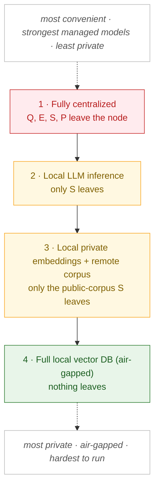
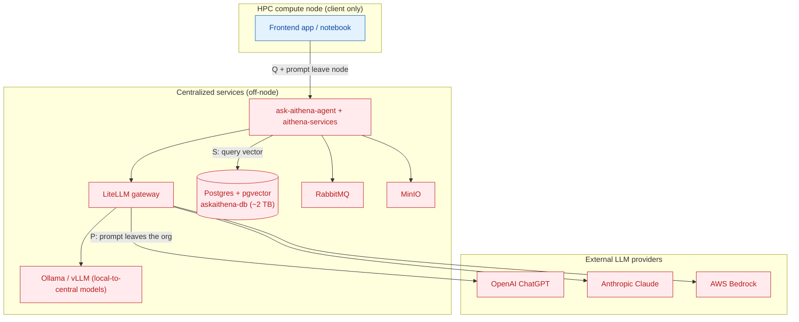
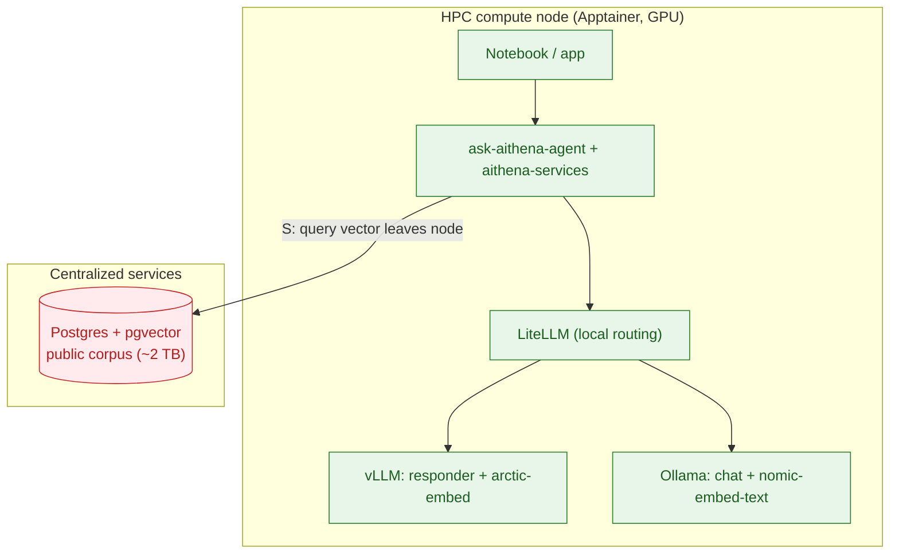
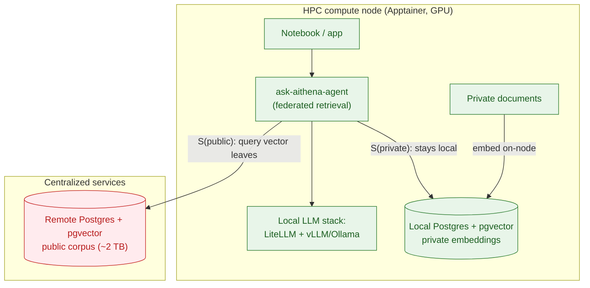
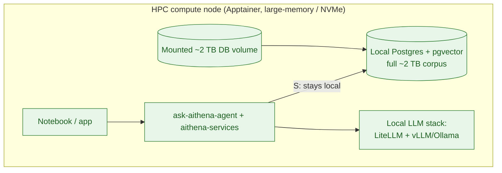

# Running Ask Aithena on an HPC: Deployment Configurations by Data Locality

**Audience:** teams evaluating how to run Ask Aithena on a High-Performance Computing (HPC)
cluster (Slurm scheduler, Apptainer/Singularity containers, login/data-transfer nodes,
GPU compute nodes) when the **confidentiality of proprietary information** matters.

This document presents four deployment configurations arranged along a single axis:
**how much proprietary "working context" leaves the compute node.** Moving down the
list trades convenience and access to strong managed models for progressively stronger
data confidentiality — from a fully centralized deployment (easiest, least private) to a
fully local, air-gapped deployment (hardest, most private).

---

## 1. The security axis: what can leave the node

Ask Aithena is a retrieval-augmented generation (RAG) service. A single question moves
through four points where proprietary content can cross the compute-node boundary:

| Symbol | Stage | Proprietary content at risk |
|:------:|-------|------------------------------|
| **Q** | **Query** submitted by the user | The question itself can be sensitive |
| **E** | **Embedding** of the query / documents | The text sent to the embedding model |
| **S** | **Vector search** against pgvector | The query vector (encodes query semantics) |
| **P** | **Prompt** sent to the responder LLM | Question **+ retrieved/attached context**, and — in the default config — this is forwarded to **third-party LLM providers** |

**Threat model.** Two classes of proprietary data are in scope:

1. **Queries** — the questions a user asks may reveal research direction or intent.
2. **Private documents** — content a user brings in to embed and search against
   (e.g. unpublished results, internal reports), which must never be exposed to a
   service that could log, monitor, or leak it.

Each configuration below pulls one more service onto the node, shrinking the set
`{Q, E, S, P}` that crosses the boundary.

---

## 2. Components (named)

| Layer | Component(s) | Role |
|-------|--------------|------|
| Client | **Ask Aithena frontend app** or the **example notebook** | Submits queries via the API |
| API / orchestration | **`ask-aithena-agent`** (FastAPI), **`aithena-services`** | RAG pipeline: retrieve → (rerank) → respond |
| LLM gateway | **LiteLLM** | One API in front of all chat/embedding models; routes to external or local backends, tracks spend |
| External models | **OpenAI (ChatGPT)**, **Anthropic (Claude)**, **AWS Bedrock** | Default responder/rerank models: **gpt‑4.1** (responder), **o4‑mini** (Shield rerank + Aegis orchestrator), **o3** (Aegis referee) |
| Local models | **Ollama**, **vLLM** (incl. **`vllm-arctic`**) | On-node inference: chat models + embeddings (**nomic‑embed‑text**, **Snowflake arctic‑embed**); **mistral‑small3.2** for semantic query-extraction (runs in every tier) |
| Vector store | **Postgres + pgvector** (`askaithena-db`, table `openalex.abstract_embeddings_arctic`), **`pgai-vectorizer-worker`** — *live Kubernetes stack*; the current **Slurm/Apptainer** reference deployment instead uses **Qdrant** (collection `full_arxiv_abstracts_nomic768`) | Embeddings of the arXiv/OpenAlex corpus; similarity search |
| Messaging / storage | **RabbitMQ** (live status), **MinIO** (blobs), **Redis** (cache/session) | Supporting services |
| Runtime | **Slurm**, **Apptainer/Singularity** | Job scheduling and unprivileged containers |

> **Embedding-space parity (applies to every local configuration):** vector search is
> only meaningful if the query is embedded with the *exact* model, version, and
> dimensionality used to build the target index. The two stacks in this repo use
> different indexes: the **live Kubernetes** corpus lives in **Postgres/pgvector**
> (table `openalex.abstract_embeddings_arctic`) built with **arctic‑embed**, while the
> current **Slurm/Apptainer** reference deployment uses a **Qdrant** collection
> (`full_arxiv_abstracts_nomic768`) built with **nomic‑embed‑text** (768‑dim) served by
> Ollama. Whichever index you target, the on-node embedder must match it exactly, or
> similarity scores are noise. *(The configurations below describe a Postgres/pgvector
> target architecture — the direction this document plans toward — not necessarily the
> current Slurm scripts.)*

> **On the "~2 TB" figure:** the corpus working-set size used throughout is a **planning
> estimate** (user-supplied). The Postgres volume provisioned in the repo
> (`deployments/kubernetes/postgres/pv.yaml`) is `10Ti`; size the mount to your actual
> index. Read every "~2 TB" below as "the large corpus working set."

---

## 3. The gradient at a glance

---

## 4. Configuration 1 — Fully centralized

All services (agent, LiteLLM, Postgres/pgvector, RabbitMQ, MinIO) run at a **central
location**. The compute node runs only a **client** — the frontend app or the notebook —
and calls the API over the network. With the default model set, LiteLLM forwards prompts
to **third-party providers**.

**Leaves the node:** Q, E, S, P — and P leaves the organization entirely.
**Security posture:** lowest. **Convenience / capability:** highest (frontier models, nothing to run locally, works from a notebook).
**Access:** frontend app *or* the example notebook — both are just clients of the same API.

**Technical hurdles**

- **Egress.** HPC compute nodes typically have **no outbound internet** and restricted
  internal routing. Reaching central services usually requires an **SSH tunnel through a
  login/data-transfer node** or an explicitly allow-listed route; the LiteLLM→provider
  hop needs true internet egress that most compute nodes lack, so this config often only
  works from login/DTN nodes or via a proxy.
- **Confidentiality.** Q and P (including any attached private documents) transit and may
  be **logged** at three points you do not control: the central agent, LiteLLM
  (request/spend logging), and the **third-party providers** (whose retention/training
  policies apply). This is the maximum exposure.
- **Multi-tenancy.** Shared central Postgres means connection limits, authz, and
  noisy-neighbor effects.
- **Secrets & TLS.** LiteLLM/provider API keys and DB credentials must reach the node
  securely (never in job scripts); internal self-signed certs need a trust decision.

---

## 5. Configuration 2 — Local LLM inference

Serve the **LLM stack on the node's GPU** (LiteLLM → vLLM/Ollama) for **both** the
embedder and the responder. Now the generation context **never leaves the node**; only the
vector search against the remote corpus does.

> Embedder and responder are kept together deliberately: splitting them (one local, one
> central) leaks a comparable amount of context either way, so it is not a meaningful
> intermediate step.

**Leaves the node:** S only (the query vector).
**Security posture:** medium–high. **Capability:** local models, weaker than the managed defaults.

**Technical hurdles**

- **GPU + weights.** Responder and embedder weights (tens of GB) must be staged on the
  parallel filesystem and loaded into GPU memory; Apptainer GPU passthrough (`--nv`); the
  responder must fit the node's GPU.
- **Model-capability gap.** The defaults are frontier reasoning models — **gpt‑4.1**
  (responder), **o4‑mini** (Shield), **o3** (Aegis referee). Local substitutes
  (Llama/Mistral/Qwen via vLLM/Ollama) are weaker, so **Shield/Aegis reranking degrades
  the most**; you may fall back to the Owl pipeline or accept lower answer quality.
- **Embedding-space parity.** "Serve LLMs locally" implicitly forces serving the **exact
  embedder that built the target index** — arctic‑embed (`vllm-arctic`) for the pgvector
  `…_arctic` table, or nomic‑embed‑text (Ollama) for the Qdrant `…_nomic768` collection —
  not just any embedder, or search is meaningless.
- **Residual leak.** The query vector S still crosses to remote Postgres, and embeddings
  are invertible enough to leak semantic intent (embedding-inversion attacks). This is
  "much better," not "zero leak."
- **Still needs** an egress/tunnel to the remote Postgres.

---

## 6. Configuration 3 — Local private embeddings + remote public corpus (hybrid)

Run a **small local Postgres/pgvector** holding embeddings of the user's **private
documents** (which never leave the node), alongside the local LLM stack. The large
**public corpus stays remote** and is queried only when needed. This is the **practical
high-security option.**

**Leaves the node:** only the **public-corpus** query vector; private documents and
purely-private queries stay local.
**Security posture:** high. **Capability:** local models + full public corpus on demand.

**Technical hurdles**

- **Federated retrieval is a code change.** Ask Aithena currently targets a **single**
  backend (one `EMBEDDING_TABLE`, one host). This config needs **two retrievers** (local
  private + remote public) with **result merging / rank fusion** (e.g. score
  normalization or Reciprocal Rank Fusion) before reranking — not supported today.
- **Shared embedding space.** Private docs must be embedded with the **same arctic‑embed
  model** as the public index for scores to be comparable — so you still run that
  embedder on-node (GPU).
- **On-node ingest pipeline.** Chunk → embed → upsert private docs into the local
  pgvector (the repo's arXiv/OpenAlex embedding jobs are a template).
- **Citation provenance.** Answers mixing private and public sources need clear
  separation of which citations came from where.
- **Residual leak.** Only the public-corpus query vector leaves; you can search private
  first and reach the remote corpus only when required.

---

## 7. Configuration 4 — Full local vector DB (air-gapped)

Bring up **Postgres/pgvector on the node against a mounted ~2 TB copy** of the full
corpus, combined with the local LLM stack. **Nothing leaves the node** — the theoretical
maximum of confidentiality, and the hardest to run.

**Leaves the node:** nothing. **Security posture:** highest (air-gapped, works with zero egress).
**Capability:** local models + full corpus, at a large resource cost.

**Technical hurdles**

- **Storage.** ~2 TB must sit on fast node-accessible storage — **node-local NVMe** (only
  the largest nodes) or a high-performance parallel FS mount (Lustre/GPFS), where
  random-access vector-index IO can be slow.
- **Memory.** A pgvector **HNSW** index over tens of millions of vectors needs very large
  RAM to perform; **IVFFlat** is lighter but lower recall. Index build is expensive.
- **Startup / warmup is prohibitive.** Copying or restoring 2 TB **per job** is a
  non-starter — you need a **persistent, pre-staged, pre-indexed** volume that jobs mount
  read-only; even then, cold-cache first queries are slow.
- **Node feasibility.** Only fat-memory / large-NVMe nodes qualify; co-locating the DB
  with GPU inference may exceed most nodes' resources and wastes an allocation.
- **Unprivileged Postgres in Apptainer.** Data dir on the mount, non-root UID, socket/port
  in user space, no systemd.
- **Mount the corpus read-only.** The mounted text corpus / pgvector data directory should
  be **read-only**, so one pre-built copy can be shared safely across jobs and cannot be
  corrupted by a run. Postgres still needs a small writable area (WAL, temp files,
  lock/stat files), so layer a writable `tmpfs`/overlay over the read-only data dir (cf.
  the repo's `--writable-tmpfs` Singularity pattern), or serve it in read-only-transaction
  mode.
- **Staleness.** The local copy diverges from the central source of truth; needs a refresh
  strategy.

**Pragmatic middle ground:** Configuration 3 delivers most of this privacy (private
content never leaves) without the 2 TB burden, and is usually the right target when
full air-gapping is not strictly required.

---

## 8. Cross-cutting hurdles

These recur across configurations and are worth solving once:

- **Service orchestration.** Coordinate the whole stack from a **single `sbatch` job that
  launches several Apptainer containers on the same node** (each service as its own
  `srun` / `apptainer instance`), sharing the node's loopback network — the pattern the
  repo's `deployments/slurm` scripts already use. Services run as unprivileged processes:
  manage ports/sockets in user space and use `--nv` for GPU passthrough.
- **Networking / egress.** Compute nodes usually cannot reach the internet or arbitrary
  internal hosts. Tunnel through login/DTN nodes; the repo's dashboard pattern
  (`ssh -L <local>:<node>:<port> …`) is the template for reaching any node-local service.
- **Secrets.** DB credentials and LiteLLM/provider keys must never live in job scripts —
  use restricted-permission files or the scheduler's secret mechanisms.
- **Embedding-space parity.** Any local retrieval must embed with the exact model/version
  that built the target index (arctic‑embed vs. nomic‑embed‑text).
- **Model capability vs. locality.** Local models trade quality for privacy; the
  Shield/Aegis reranking tiers are the most sensitive to this.
- **Drop LiteLLM for a lighter local stack.** The **LiteLLM gateway is optional** for the
  local configurations — point `ask-aithena-agent` directly at the model servers. Run just
  **Ollama + vLLM**, or **two vLLM instances** (one serving the embedding model, one the
  chat/responder model), to cut a moving part and its memory overhead. You lose LiteLLM's
  unified routing and spend-tracking, which matter less once everything is on-node.
- **Scheduler shape.** Long-running services (Postgres, vLLM/Ollama, and — if kept —
  LiteLLM, RabbitMQ, MinIO, Redis) do not fit the batch-job model cleanly — run them as the
  multi-Apptainer `sbatch` above, held open for the session's interactive/batch work.

---

## 9. Summary

| # | Configuration | On the node | Leaves the node | Security | Model quality | Chief hurdle |
|---|---------------|-------------|-----------------|:--------:|:-------------:|--------------|
| 1 | Fully centralized | client only | Q, E, S, P (+ to providers) | lowest | highest | egress + data leaves the org |
| 2 | Local LLM inference | LLM stack | S | medium–high | local (weaker) | GPU + embedding parity |
| 3 | Local private embeddings + remote corpus | LLM stack + private pgvector | public-corpus S | high | local (weaker) | federated retrieval (code) |
| 4 | Full local vector DB (air-gapped) | everything (~2 TB) | nothing | highest | local (weaker) | 2 TB provisioning + memory |

**Rule of thumb:** start at the least-local configuration your data-sensitivity policy
allows. Configuration 1 for public/low-sensitivity work with the strongest models;
Configuration 2 when the working context must stay on-node; Configuration 3 when private
documents are involved (the practical high-security default); Configuration 4 only when a
true air-gap is mandatory and a large enough node is available.
